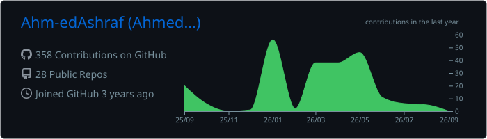
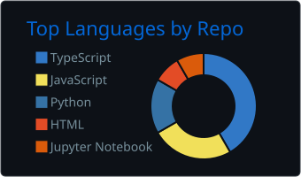
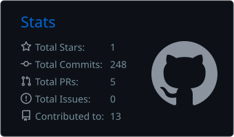
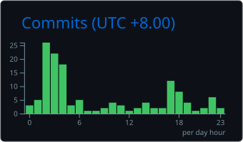

<h1 align="center">Ahmed Ashraf</h1>

  <strong>Full-Stack Developer &middot; AI Automation &middot; Applied Machine Learning</strong> 
  I build production-ready products that turn data and AI into useful user experiences.

  
  
  

## About me

- Computer Science student specializing in **Data Analytics**
- Based between **Kuala Lumpur, Malaysia** and **KAEC, Saudi Arabia**
- Building across **full-stack development, AI automation, data products, and applied ML**
- Interested in practical systems with measurable technical and business value

## Selected projects

### [FactoryPulse Lite](https://github.com/Ahm-edAshraf/FactoryPulse-Lite)

Predictive-maintenance platform created for **V HACK 2026**. Estimates remaining useful life, classifies machine health, detects degradation change points, and turns sensor data into actionable maintenance insights.

`Python` `XGBoost` `Streamlit` `Plotly` `pandas` `ruptures`

### [FormAI](https://github.com/Ahm-edAshraf/FormAi) &middot; [Live demo](https://formai-ten.vercel.app/)

AI-powered form builder that generates forms from natural-language prompts. Includes drag-and-drop editing, publishing, file uploads, response collection, and Stripe billing.

`Next.js` `TypeScript` `Tailwind CSS` `Supabase` `Gemini` `Stripe`

### [NCR Ride Booking Analytics](https://github.com/Ahm-edAshraf/streamlit-uber-dataset-prediction)

Analytics and machine-learning application built around more than 150,000 booking records. Includes interactive dashboards, real-time prediction, model explainability, and a LightGBM pipeline.

`Python` `Streamlit` `LightGBM` `Plotly` `pandas`

### [APU Student Helper](https://github.com/Ahm-edAshraf/apu-student-help)

AI-powered study companion with academic assistance, deadline tracking, study analytics, document handling, and Progressive Web App support.

`Next.js 15` `React 19` `TypeScript` `Supabase` `Gemini` `Tailwind CSS`

### [AI Code Reviewer](https://github.com/Ahm-edAshraf/ai-code-reviewer)

Automated pull-request reviewer that uses Gemini to identify bugs, code-quality issues, performance concerns, and security risks, then posts structured feedback to GitHub.

`Python` `Flask` `Gemini API` `GitHub API`

<strong>More work</strong>

 

**[Resume-Job Matching with NLP](https://github.com/Ahm-edAshraf/resume-parser)** - NLP pipeline for resume-to-job matching using keyword extraction, semantic embeddings, PDF processing, similarity scoring, and skill-gap analysis.

`Python` `spaCy` `KeyBERT` `Sentence Transformers` `scikit-learn`

## Toolbox

  

**Frontend:** Next.js, React, TypeScript, JavaScript, Tailwind CSS, Radix UI 
**Backend:** Node.js, Express, Python, Flask, FastAPI 
**Data and databases:** PostgreSQL, Supabase, SQLAlchemy, pandas, NumPy, Plotly 
**AI and ML:** LightGBM, XGBoost, scikit-learn, spaCy, KeyBERT, Sentence Transformers, LangChain, OpenAI, Gemini

## GitHub activity

<!-- Generated daily by .github/workflows/profile-summary-cards.yml. -->

  

  
  

  

## Let's connect

  <a href="mailto:ahmedashrafyas@gmail.com">Email</a>
  &nbsp;&middot;&nbsp;
  <a href="https://www.linkedin.com/in/ahmed-ashraf-5ab7bb334/">LinkedIn</a>
  &nbsp;&middot;&nbsp;
  <a href="https://ahm-edashraf.github.io/portofolio/">Portfolio</a>
  &nbsp;&middot;&nbsp;
  Discord: <code>luhahmed</code>

  

